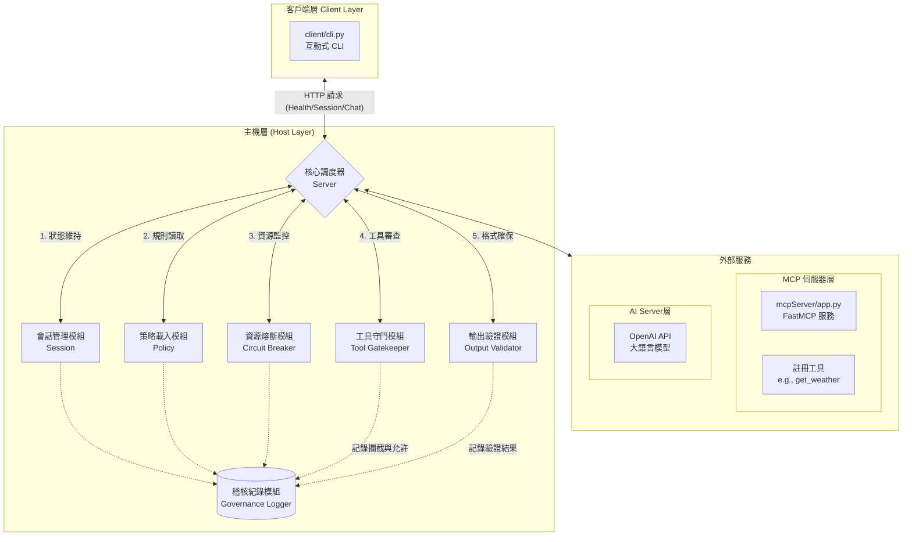

# cva-midterm-mcp

## 專案簡介 (Project Description)
`cva-midterm-mcp` 是一個整合主機端（Host）、客戶端（Client）與模型上下文協議伺服器（Model Context Protocol Server, MCP Server）的系統。本專案透過 OpenAI 套件提供對話服務，並內建工具治理（Tool Governance）、輸出驗證（Output Validation）及資源熔斷機制（Resource Circuit Breaker），確保AI系統運行的安全性與穩定性。

## 核心功能 (Core Features)
* **上下文與策略管理 (Policy / Context Management)**：支援多種情境，並可依據上下文套用不同的系統提示詞（System Prompt）與工具使用權限。
* **工具治理 (Tool Governance)**：嚴格控管工具呼叫，檢測參數意圖，並記錄所有允許與拒絕的動作至稽核日誌（Audit Log）。
* **資源熔斷機制 (Resource Circuit Breaker)**：即時監控 Token 消耗量、模型呼叫次數、工具頻率與執行延遲（Latency），超限時將自動中斷並保護系統。
* **引用驗證 (Citation Verification)**：要求模型產出時附帶 `[citation:1]` 格式的來源標記，確保回答的準確性與可追溯性。

## 系統需求 (Prerequisites)
* Python 版本：`>=3.13`

## 安裝指南 (Installation)
1. 複製專案原始碼：
   ```bash
   git clone <repository_url>
   cd cva-midterm-mcp
   uv sync
   ```

## 快速啟動 (Quick Start)
執行以下指令啟動 Host HTTP API 與本機 MCP Server：
```Bash
uv run main.py
```
或
```Bash
python main.py
```

## 專案架構 (Project Structure)
詳細功能：[點我](docs\CURRENT_IMPLEMENTED_FEATURES.md)

host/：處理伺服器 HTTP API、會話狀態（Session State）、策略載入（Policy Loading）與各種驗證器（Validators）。

client/：提供使用者進行互動式操作的 CLI 工具。

mcpServer/：包含 FastMCP 伺服器與註冊的工具。

docs/：存放專案實作文件與功能規劃。

tests/：包含工具守門機制（Tool Gatekeeper）、資源熔斷（Circuit Breaker）等自動化測試模組。

